# 🎚️ Signal Equalizer Web Application

A full-stack signal equalizer built with **Angular** (frontend) and **FastAPI** (backend), supporting multiple equalization modes, wavelet-domain processing, AI-powered source separation, and real-time spectrograms.

---

## 📋 Table of Contents

- [Overview](#overview)
- [Frontend Components](#frontend-components)
- [Backend Endpoints](#backend-endpoints)
- [Modes](#modes)
- [UI Screenshots](#ui-screenshots)
- [Installation](#installation)
- [Usage](#usage)
- [Wavelet Support](#wavelet-support)
- [AI Models](#ai-models)

---

## Overview

This application allows users to load audio or ECG signals, manipulate frequency components using interactive sliders, and reconstruct the modified signal in real time. It supports both standard Fourier-domain equalization and wavelet-domain processing, with AI-assisted source separation for customized modes.

---

## Frontend Components

The Angular frontend is organized into the following components:

| Component | Description |
|---|---|
| `cine-viewer` | Animated signal playback viewer with full transport controls |
| `eq-sidebar` | Equalizer slider panel; adapts labels and count per mode |
| `generic-mode-panel` | UI for defining arbitrary frequency subdivisions |
| `signal-viewer` | Static/scrollable signal display for input and output |
---

## Backend Endpoints

All endpoints are served by **FastAPI**. Base URL: `http://localhost:8000`

| Method | Endpoint | Description |
|---|---|---|
| `POST` | `/applyfrequencygains` | Apply FFT-domain gain bands to a raw signal array |
| `POST` | `/applywaveletgains` | Apply per-level wavelet-domain gains |
| `POST` | `/computespectrogram` | Compute spectrogram (frequencies, times, power array) |
| `POST` | `/equalize` | Sparse-mask EQ on a WAV file using a JSON mask config |
| `POST` | `/convertecgtojson` | Convert `.mat` / `.hea` ECG file to JSON signal data |
| `POST` | `/decomposeecg` | Classify ECG beats and return per-arrhythmia components |
| `POST` | `/segmenthumanvoice` | AI voice separation (SepFormer) → 4 speaker tracks |
| `POST` | `/segmentmusic` | AI instrument separation (Demucs) → bass, drums, guitar, piano |

---

## Modes

### 1. Generic Mode

Users define arbitrary frequency subdivisions via the `generic-mode-panel` component, set each band's frequency range and gain, and save/load configurations as JSON.

> **📸 Generic Mode Panel**
>
> 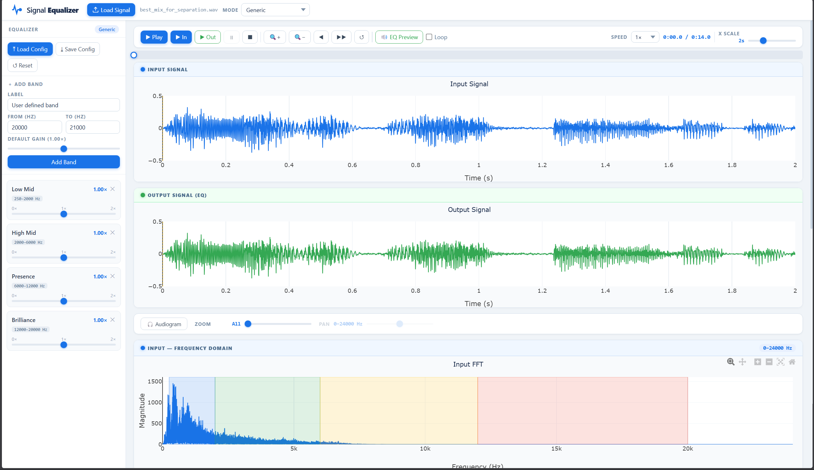
> *Caption: `generic-mode-panel` component — user-defined frequency bands with adjustable lower/upper limits and gain sliders.*

> **📸 Screenshot Placeholder — Generic Mode Config Save/Load**
>
> 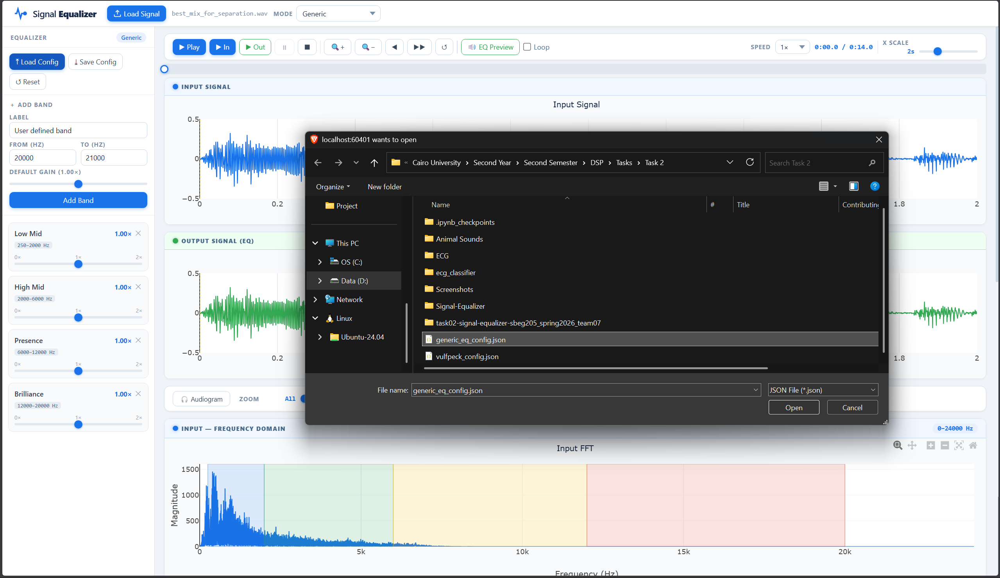
> *Caption: Saving and reloading a custom band layout from a JSON config file.*

---

### 2. Musical Instruments Mode

Each slider in `eq-sidebar` controls one instrument stem (bass, drums, guitar, piano). Stems are pre-separated via the `/segmentmusic` endpoint using **Demucs (htdemucs_6s)**, then frequency masks are applied through `/equalize`.

> **📸 Musical Instruments Mode**
>
> 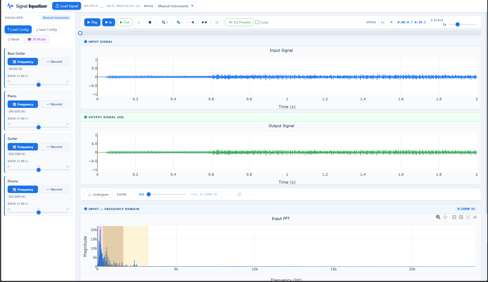
> *Caption: `eq-sidebar` at frequency mode with four sliders labeled Bass, Drums, Guitar, Piano.*
> 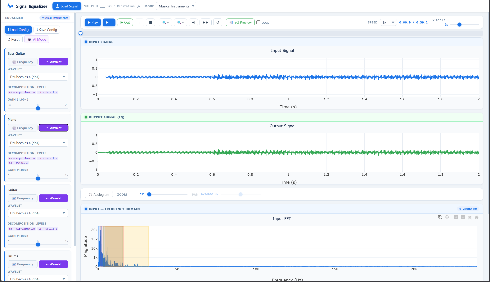
> *Caption: `eq-sidebar` at wavelet mode with four sliders labeled Bass, Drums, Guitar, Piano.*

---

### 3. Animal Sounds Mode

Each slider controls the gain of a specific animal sound. Frequency masks loaded from a config file are applied in the FFT domain via `/applyfrequencygains`.

> **📸 Animal Sounds Mode**
>
> 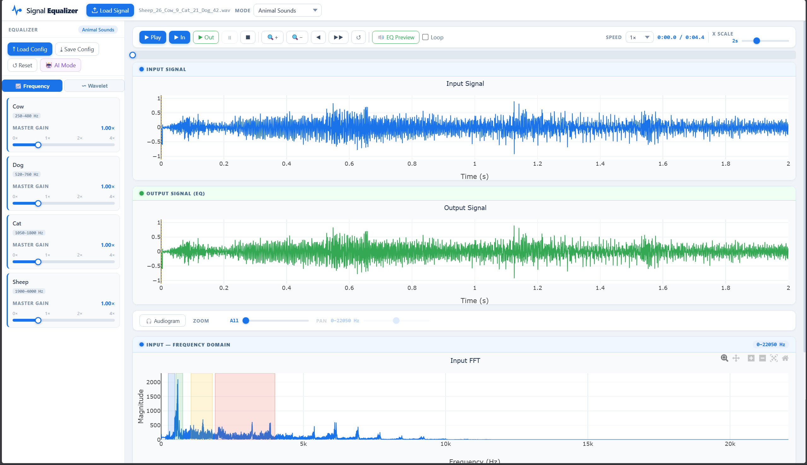
> *Caption: `eq-sidebar` relabeled for animal sounds; frequency masks isolate each animal's spectral region.*
> 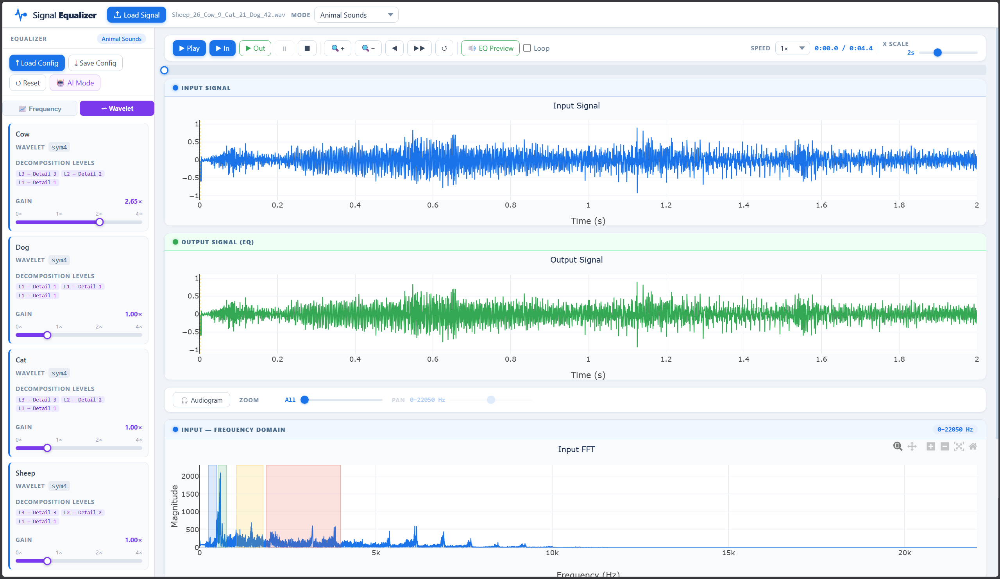
> *Caption: `eq-sidebar` relabeled for animal sounds; wavelet masks isolate each animal's spectral region.*
> 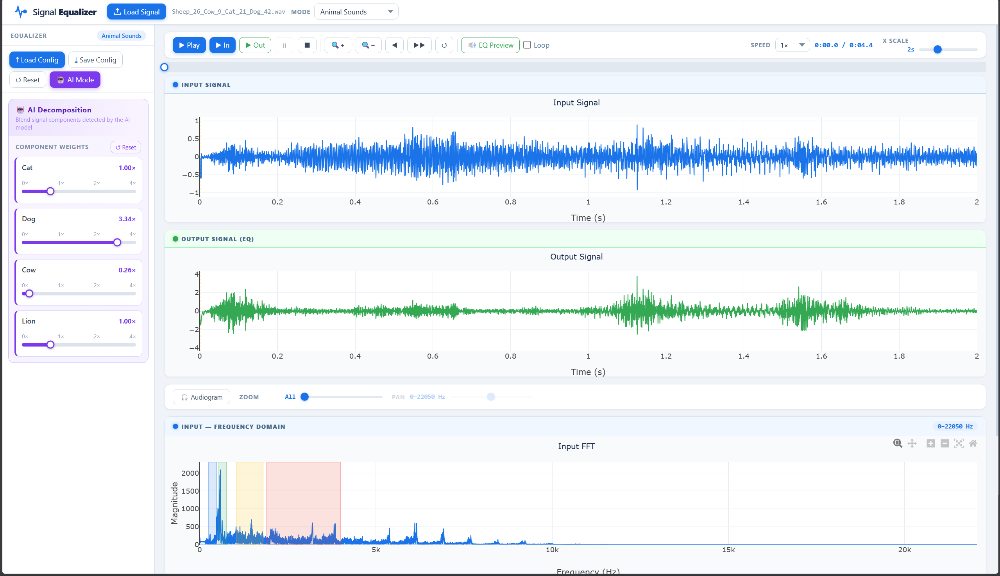
> *Caption: `eq-sidebar` relabeled for animal sounds; AI segmentation isolate each animal's spectral region.*

---

### 4. Human Voices Mode

Each slider controls the gain of a separated speaker track. Separation is performed by `/segmenthumanvoice` using **SepFormer**, returning 4 speaker channels of mixed genders, ages, and languages.

> **📸 Human Voices Mode**
> 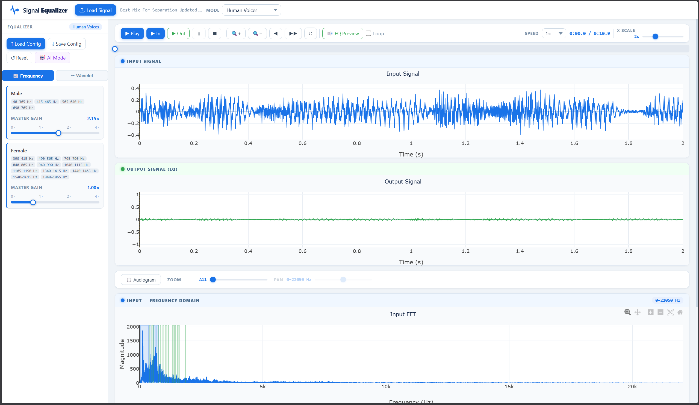
> *Caption: Two voice sliders controlling magnitude of male and female voices at frequency domain.*
> 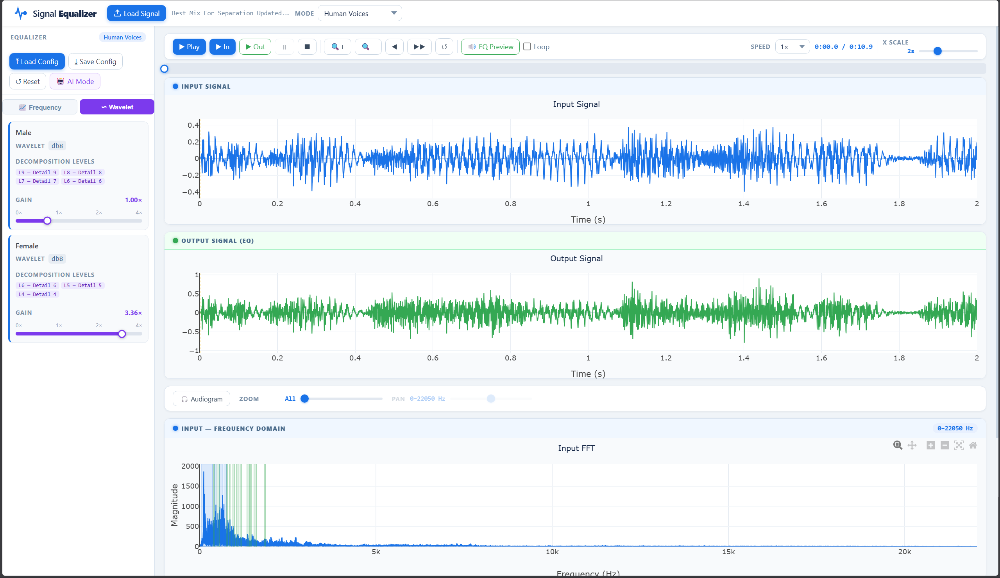
> *Caption: Four voice sliders (Voice 1–4) controlling magnitude of male and female voices at wavelet domain*
> 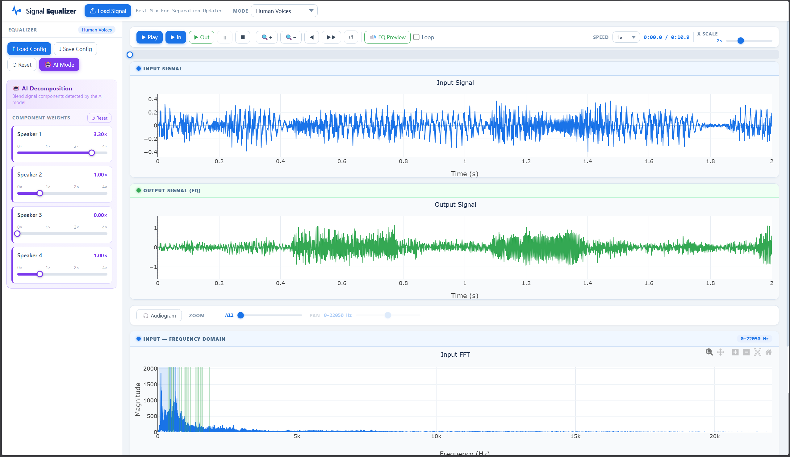
> *Caption: Four voice sliders (Voice 1–4) controlling AI-separated speaker tracks.*

---

### 5. ECG Abnormalities Mode

Uploads a `.mat` ECG file to `/decomposeecg`, which uses a trained CNN to classify beats into arrhythmia types. Each slider controls the magnitude of one beat-type component.

**Supported Beat Labels:**

| Symbol | Beat Type |
|---|---|
| `N` | Normal Beat |
| `A` | Atrial Premature Beat |
| `V` | Premature Ventricular Contraction |
| `L` | Left Bundle Branch Block |
| `R` | Right Bundle Branch Block |
| `E` | Ventricular Escape Beat |
| `/` | Paced Beat |

> **📸 ECG Mode**

> 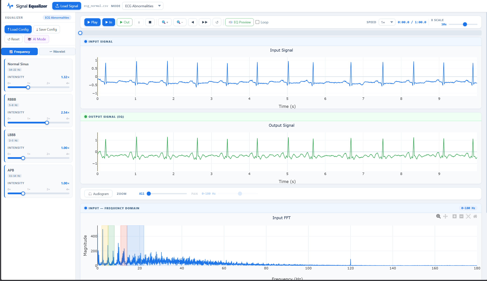
> *Caption: ECG signal decomposed by beat type in frequency domain; `eq-sidebar` sliders labeled by arrhythmia class.*
> 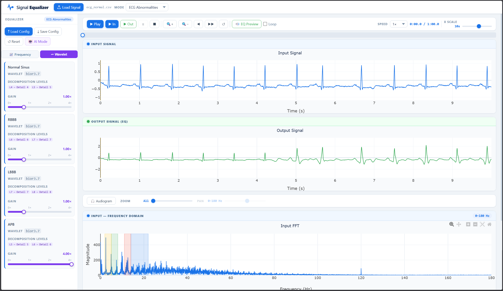
> *Caption: ECG signal decomposed by beat type in wavelet domain; `eq-sidebar` sliders labeled by arrhythmia class.*
> 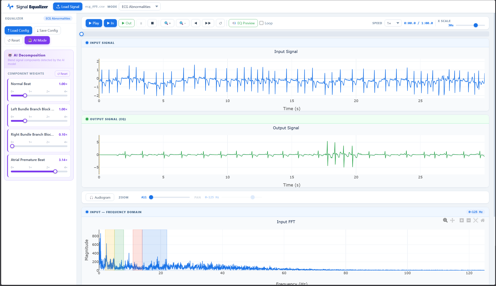
> *Caption: ECG signal decomposed by beat type in AI mode; `eq-sidebar` sliders labeled by arrhythmia class.*

---

## UI Screenshots


### `cine-viewer` — Animated Signal Playback

The `cine-viewer` component displays both input and output signals as animated waveforms running in time. Both viewers are fully synchronized — any scroll, zoom, or pan on one is instantly mirrored in the other.

> **📸 Cine Viewer (Playing)**
>
> 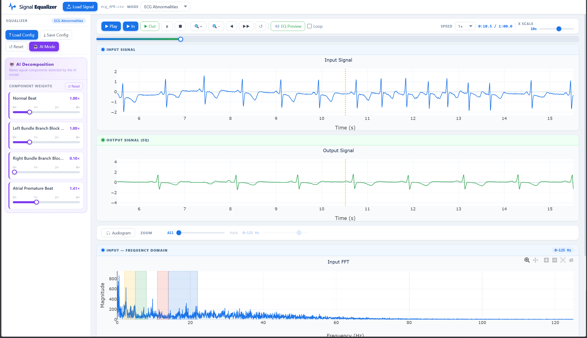
> *Caption: Input and output `cine-viewer` running synchronously during playback.*

**Transport Controls:**

| Control | Description |
|---|---|
| ▶ Play | Start animated playback |
| ⏸ Pause | Freeze at current position |
| ⏹ Stop | Stop and return to start |
| Speed | Playback speed multiplier |
| Zoom | Zoom in/out on the time axis |
| Pan | Scroll along the time axis |
| Reset | Restore default view |

---


### Spectrograms

Two spectrograms (input and output) update live as sliders change. A toggle button shows or hides both.

> **📸 Spectrograms Side by Side**
>
> 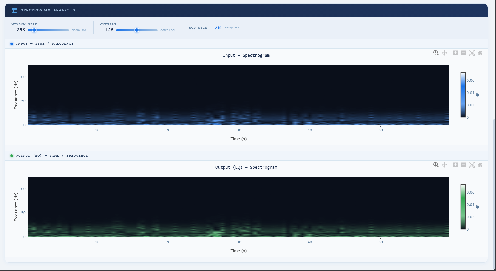
> *Caption: Input spectrogram (left) and output spectrogram (right) computed via `/computespectrogram`.*

---

### Frequency Domain — Linear vs. Audiogram Scale

> **📸  Linear Scale**
>
> 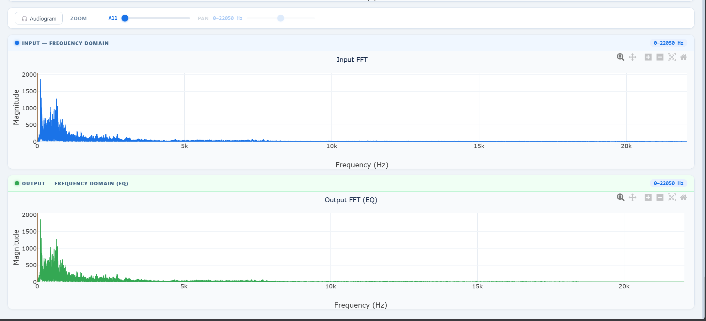
> *Caption: FFT magnitude spectrum on a linear frequency axis.*

> **📸 Audiogram Scale**
>
> 
> *Caption: Same spectrum on an audiogram (logarithmic) scale, matching the clinical hearing plot convention.*

---

## Installation

### Backend

```bash
cd backend
pip install -r requirements.txt

# Create required upload/output directories
mkdir -p uploadedFiles/ECGFiles uploadedFiles/HumanVoices uploadedFiles/Music
mkdir -p segmentedFiles/temp

uvicorn main:app --reload
```

### Frontend

```bash
cd frontend
npm install
ng serve
```

The app will be available at `http://localhost:4200`.

---

## Usage

1. Start the backend: `uvicorn main:app --reload` (port 8000)
2. Start the frontend: `ng serve` (port 4200)
3. Select a **mode** from the dropdown — `eq-sidebar` sliders update automatically.
4. Upload a signal file (`.wav`, `.mp3`, `.mat`, or `.hea`).
5. Adjust sliders to modify frequency or wavelet gains.
6. Watch the output `signal-viewer` and spectrogram update live.
7. Use the `cine-viewer` transport controls to play back the signal.
8. Optionally save your band configuration for later reload.

---

## Wavelet Support
 
Wavelet-domain equalization is available via `/applywaveletgains` using **PyWavelets**. The decomposition splits the signal into one approximation level and N detail levels; each slider can target a specific level.
 
| Mode | Recommended Wavelet | Reason |
|---|---|---|
| Musical Instruments | `db8` | Good frequency resolution for tonal content |
| Animal Sounds | `sym5` | Balanced time-frequency trade-off |
| Human Voices | `db4` | Efficient for speech-band separation |
| ECG Abnormalities | `bior3.7` | Standard in ECG denoising literature |
---
 
## AI Models
 
| Mode | Endpoint | Model | Library |
|---|---|---|---|
| Musical Instruments | `/segmentmusic` | Demucs `htdemucs_6s` | `audio-separator` |
| Human Voices | `/segmenthumanvoice` | SepFormer `sepformer-wsj02mix` | SpeechBrain |
| ECG Abnormalities | `/decomposeecg` | CNN (7-class beat classifier) | TensorFlow / Keras |
 
 ---

## Synthetic Signal Validation

A synthetic test signal composed of pure sinusoids spanning the full frequency range was used to validate Generic Mode. Setting a band's gain to 0 and confirming its disappearance in the output FFT verifies correct band isolation.

> **📸 Synthetic Signal Test**
>
> 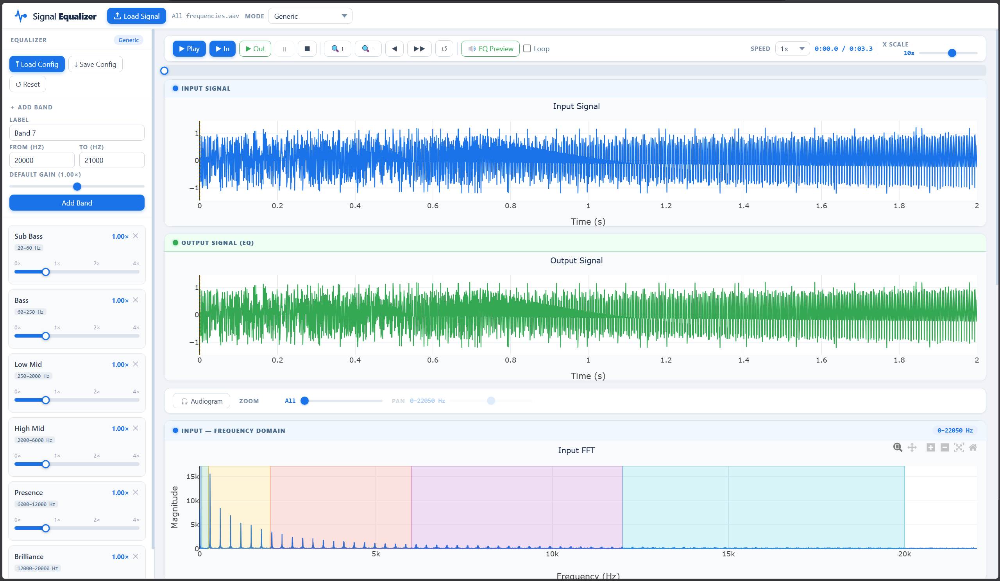
> 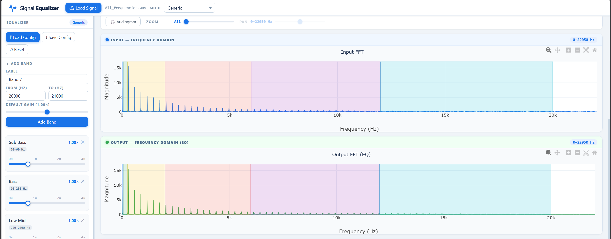
> 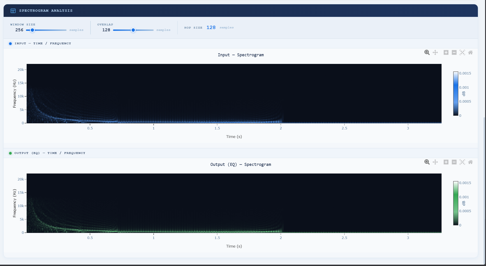


> *Caption: Input synthetic signal (top) composed of pure sinusoidals frequencies; FFT and spectrogram confirm that shape*

---

## License

Developed as part of a DSP / Biomedical Signal Processing course project.
